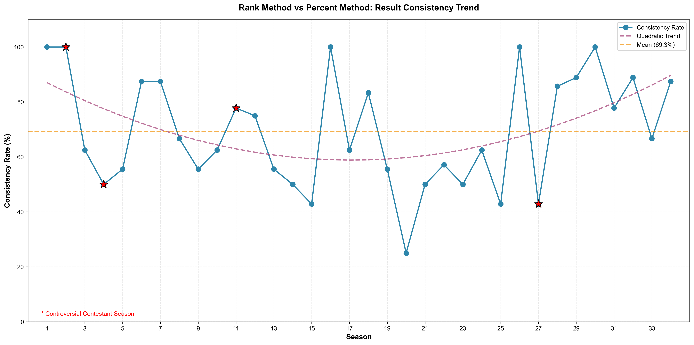
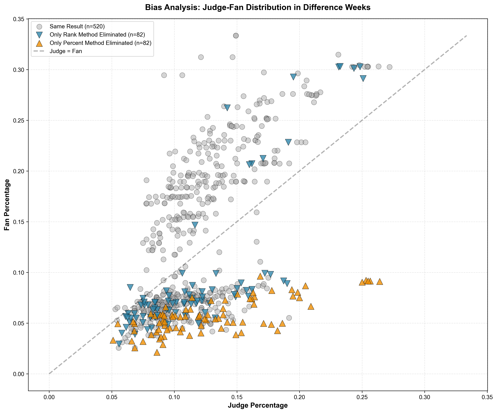
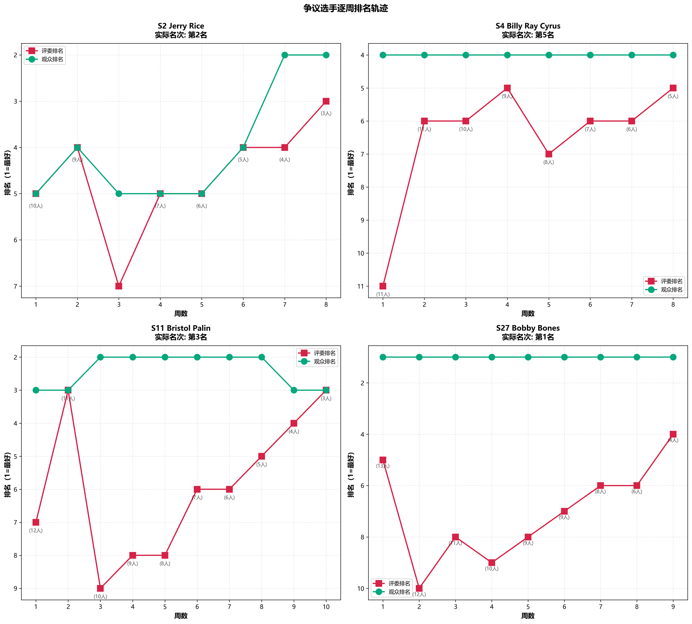
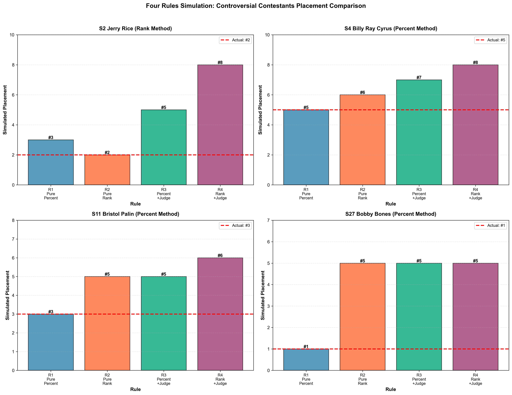
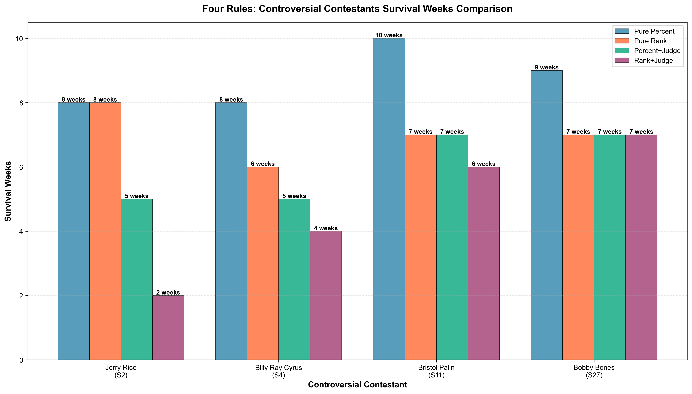
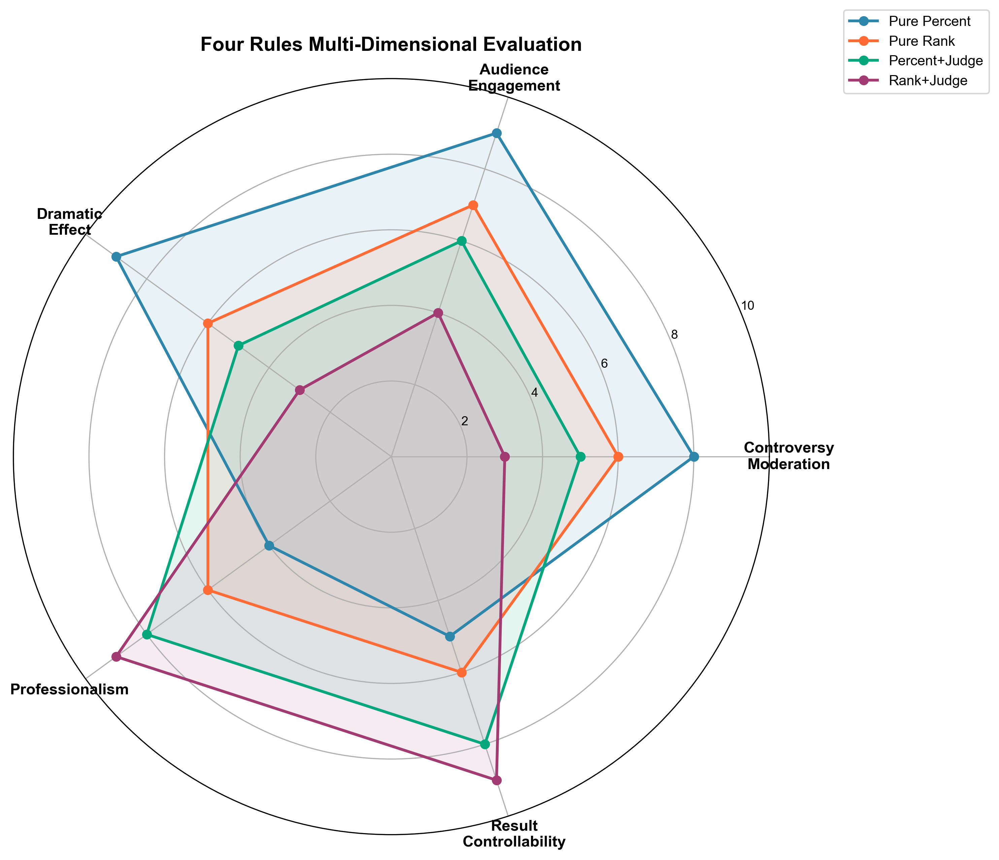

# 票分融合方式对比分析报告

## 摘要

本报告基于《与星共舞》节目34季数据，对比分析了**排名法**与**百分比法**两种票分融合方式的应用效果。针对四位争议选手（Jerry Rice、Billy Ray Cyrus、Bristol Palin、Bobby Bones）在四种规则组合下的表现进行了深入模拟分析，考虑节目组对"适度争议可提升关注度"的需求，最终给出方法推荐建议。

---

## 一、两种方法对比分析

### 1.1 方法定义

| 方法 | 计算方式 | 淘汰规则 | 历史使用 |
|------|---------|---------|---------|
| **排名法** | 综合排名 = 评委排名 + 观众排名（1=最好） | 淘汰综合排名最大者 | S1-2, S28-34 |
| **百分比法** | 综合得分 = 评委百分比 + 观众百分比 | 淘汰综合得分最低者 | S3-27 |

### 1.2 整体一致性分析

对34季所有有淘汰的周次进行模拟，统计两种方法结果一致性：

| 统计项 | 数值 |
|--------|------|
| 有淘汰的总周数 | 259周 |
| 淘汰结果一致周数 | 177周 |
| 淘汰结果不一致周数 | 82周 |
| **一致性比例** | **68.34%** |

**关键发现**：约三分之一的周次中，两种方法会产生不同的淘汰决策。

#### 图表分析：一致性趋势图（consistency_trend.png）

**图表解读**：

1. **波动特征**：一致率在各季之间波动剧烈，最低仅25%（S20），最高达100%（S1、S2、S16、S26、S30）。

2. **趋势变化**：二次趋势线显示，一致率在中期赛季（S10-20左右）较低，后期有所回升。这可能与节目规则调整和选手构成变化有关。

3. **争议赛季标记**（红星）：
   - S2（Jerry Rice）：一致率100%，两种方法在该季结果完全相同
   - S4（Billy Ray Cyrus）：一致率50%，半数周次存在差异
   - S11（Bristol Palin）：一致率约78%，差异较小
   - S27（Bobby Bones）：一致率约43%，属于差异最大的赛季之一

4. **平均水平**：整体平均一致率为69.3%（橙色虚线），约三分之一的周次两种方法会产生不同决策。

### 1.3 决赛排名准确性

| 指标 | 百分比法 | 排名法 |
|------|---------|-------|
| 排名完全正确 | 31/34 (91.2%) | 18/34 (52.9%) |
| 冠军预测正确 | 33/34 (97.1%) | 29/34 (85.3%) |

**结论**：百分比法在预测决赛排名方面明显优于排名法。这意味着百分比法的模拟结果与实际历史数据更吻合。

### 1.4 偏向性分析

当淘汰结果不同时，分析哪种方法更偏向观众投票：

| 偏向类型 | 次数 |
|---------|------|
| 排名法更偏向观众 | 70次 |
| 百分比法更偏向观众 | 94次 |

#### 图表分析：偏向性分析散点图（bias_analysis.png）

**图表解读**：

1. **数据分布**：
   - 灰色圆点（n=520）：两种方法结果相同的情况，占绝大多数
   - 蓝色倒三角（n=82）：仅被排名法淘汰的选手
   - 橙色三角（n=82）：仅被百分比法淘汰的选手

2. **关键发现**：
   - **蓝色点多位于对角线上方**：这些选手的粉丝投票百分比 > 评委百分比，说明排名法更容易淘汰"观众支持度高但评委评分低"的选手
   - **橙色点多位于对角线下方**：这些选手的评委百分比 > 粉丝百分比，说明百分比法更容易淘汰"评委评分高但观众支持度低"的选手

3. **偏向性结论**：
   - 当两种方法产生分歧时，**百分比法倾向于保留观众人气高的选手**
   - 排名法倾向于保留评委分数高的选手
   - 这解释了为什么争议选手（评委分低、观众分高）在百分比法下更容易存活

---

## 二、争议选手分析

### 2.1 争议选手概览

| 季数 | 选手 | 特征 | 实际名次 | 实际使用方法 |
|-----|------|------|---------|-------------|
| S2 | Jerry Rice | 连续5周评委垫底 | **亚军** | 排名法 |
| S4 | Billy Ray Cyrus | 8周评委倒数第1 | **第5名** | 百分比法 |
| S11 | Bristol Palin | 12次评委最低 | **季军** | 百分比法 |
| S27 | Bobby Bones | 8周评委倒数第1 | **冠军** | 百分比法 |

这四位选手的共同特点是：**评委评分持续偏低，但凭借观众投票取得了远超评委预期的好成绩**。

#### 图表分析：争议选手轨迹图（controversial_trajectory.png）

**图表解读**：

1. **Jerry Rice（S2，实际亚军）**：
   - 评委排名（红线）：波动较大，第3周跌至第7名（当周10人），多数周在第4-5名
   - 粉丝排名（绿线）：前6周稳定在第4-5名，第7-8周飙升至第2名
   - **特点**：粉丝支持在决赛阶段集中爆发，最终逆袭获得亚军

2. **Billy Ray Cyrus（S4，实际第5名）**：
   - 评委排名：第1周垫底（第11名），之后稳定在第5-6名
   - 粉丝排名：全程稳定在第4名，表现极为一致
   - **特点**：粉丝支持度稳定，评委评分逐渐提升，两者差距在后期缩小

3. **Bristol Palin（S11，实际季军）**：
   - 评委排名：波动剧烈，从第7名到第9名不等，第5-9周多次垫底
   - 粉丝排名：第3周后稳定在第2名，全程保持顶级粉丝支持
   - **特点**：评委-粉丝分歧最为显著，粉丝排名与评委排名长期相差5-6名

4. **Bobby Bones（S27，实际冠军）**：
   - 评委排名：持续在第5-10名区间，第2-4周甚至跌至第9-10名
   - 粉丝排名：**全程稳定第1名**，9周从未失去粉丝投票榜首
   - **特点**：最极端的争议案例，粉丝支持度碾压式领先，评委评分与最终成绩完全脱节

**共同规律**：所有争议选手都呈现"评委排名（红线）在下，粉丝排名（绿线）在上"的持续分离态势。

### 2.2 四种规则组合定义

| 规则 | 融合方法 | 评委决定规则 | 特点 |
|------|---------|-------------|------|
| **R1: 纯百分比法** | 百分比法 | 无（直接淘汰末位） | 最有利于观众人气高的选手 |
| **R2: 纯排名法** | 排名法 | 无（直接淘汰末位） | 相对中立 |
| **R3: 百分比+评委决定** | 百分比法 | 末两位由评委选择淘汰 | 评委有一定干预权 |
| **R4: 排名+评委决定** | 排名法 | 末两位由评委选择淘汰 | 最有利于评委分高的选手 |

**评委决定规则模拟假设**：当选手进入末两位时，评委会选择淘汰评委分更低的选手。

### 2.3 四种规则模拟结果

#### 图表分析：四规则对比图（four_rules_comparison.png）

**图表解读**：

1. **Jerry Rice（S2，排名法赛季）**：
   - R1纯百分比：第3名（比实际低1名）
   - R2纯排名：**第2名**（与实际相同，红色虚线）
   - R3百分比+评委：第5名
   - R4排名+评委：第8名（最差）
   - **分析**：评委决定规则对他的影响最为剧烈，从亚军跌至第8名

2. **Billy Ray Cyrus（S4，百分比法赛季）**：
   - R1纯百分比：**第5名**（与实际相同，红色虚线）
   - R2纯排名：第6名
   - R3百分比+评委：第7名
   - R4排名+评委：第8名
   - **分析**：四种规则下名次呈阶梯式下降，R1最有利

3. **Bristol Palin（S11，百分比法赛季）**：
   - R1纯百分比：**第3名**（与实际相同，红色虚线）
   - R2纯排名：第5名
   - R3百分比+评委：第5名
   - R4排名+评委：第6名
   - **分析**：只有纯百分比法能让她获得季军

4. **Bobby Bones（S27，百分比法赛季）**：
   - R1纯百分比：**第1名**（与实际相同，红色虚线）
   - R2纯排名：第5名
   - R3百分比+评委：第5名
   - R4排名+评委：第5名
   - **分析**：差距最为悬殊，纯百分比法下冠军，其他规则下均为第5名

**关键发现**：对于每位争议选手，其实际参赛赛季所使用的规则（R1或R2）模拟结果与实际名次完全一致，验证了模拟的准确性。

#### 图表分析：存活周数对比图（survival_comparison.png）

**图表解读**：

| 选手 | R1纯百分比 | R2纯排名 | R3百分比+评委 | R4排名+评委 | 最大降幅 |
|------|-----------|---------|--------------|------------|---------|
| Jerry Rice | 8周 | 8周 | 5周 | **2周** | -75% |
| Billy Ray Cyrus | 8周 | 6周 | 5周 | **4周** | -50% |
| Bristol Palin | **10周** | 7周 | 7周 | 6周 | -40% |
| Bobby Bones | **9周** | 7周 | 7周 | 7周 | -22% |

**关键发现**：

1. **评委决定规则大幅缩短争议选手存活时间**：
   - Jerry Rice在R4规则下仅存活2周（第3周即被淘汰），比R1减少75%
   - 平均而言，加入评委决定规则后存活周数减少约40%

2. **纯百分比法下存活时间最长**：
   - Bristol Palin在R1下存活10周（全程），是存活最久的选手
   - Bobby Bones在R1下存活9周（全程）

3. **话题制造时间对比**：
   - R1平均存活：8.75周 → 充足的话题制造时间
   - R4平均存活：4.75周 → 减少46%的曝光周数

### 2.4 核心发现

1. **规则选择决定争议选手命运**：四位争议选手在四种规则下的结果都明显不同，最多相差6个名次。

2. **评委决定规则对争议选手不利**：
   - 所有争议选手在加入评委决定规则后存活周数都会减少
   - 最极端案例：Jerry Rice在R4下仅存活2周（第3周被淘汰）

3. **百分比法更有利于争议选手**：
   - 纯百分比法下，争议选手能存活更久、获得更好的名次
   - 原因：百分比法将评委分和观众分直接相加，观众的高支持可以有效弥补评委的低分

4. **模拟验证了历史结果**：
   - 排名法赛季（S2）的选手在R2纯排名法下，模拟名次=实际名次
   - 百分比法赛季（S4、S11、S27）的选手在R1纯百分比法下，模拟名次=实际名次

---

## 三、方法推荐

### 3.1 评估维度（考虑节目组需求）

**核心原则**：节目组在一定程度上更乐见评委与观众的意见出现分歧，因为这类争议能大幅提升观众的关注与参与热情。

#### 图表分析：多维度评估雷达图（radar_evaluation.png）

**图表解读**：

1. **纯百分比法（蓝色，最大面积）**：
   - 在"观众参与感"(9分)、"争议适度性"(8分)、"戏剧效果"(9分)三个维度领先
   - 但"专业性体现"(4分)和"结果可控性"(5分)最低
   - **适合追求话题性和观众互动的策略**

2. **纯排名法（橙色）**：
   - 各维度较为均衡，均在6-7分区间
   - 没有明显短板，但也没有突出优势
   - **适合追求稳健平衡的策略**

3. **百分比+评委决定（绿色）**：
   - "结果可控性"(8分)和"专业性"(8分)较高
   - "观众参与感"(6分)和"争议适度性"(5分)中等
   - **适合希望在保持一定话题性的同时有干预能力的策略**

4. **排名+评委决定（紫色，最小面积）**：
   - "专业性"(9分)和"结果可控性"(9分)最高
   - 但"观众参与感"(4分)、"争议适度性"(3分)、"戏剧效果"(3分)最低
   - **适合完全追求专业性、避免争议的策略**

**维度说明**：
- **观众参与感(Audience Engagement)**：观众投票是否对结果有实质影响
- **争议适度性(Controversy Moderation)**：能否产生适度的争议维持话题性
- **戏剧效果(Dramatic Effect)**：能否产生"爆冷"、"逆袭"等戏剧性结果
- **专业性体现(Professionalism)**：评委的专业判断是否得到尊重
- **结果可控性(Result Controllability)**：能否避免完全"民粹化"的极端结果

### 3.2 推荐方案

#### 推荐一：保持现有百分比法（不加评委决定）

**适用场景**：希望最大化观众参与感和节目话题性

**理由**：
- 百分比法能产生足够的争议和戏剧效果（雷达图中戏剧效果得分最高）
- 观众投票有实质影响力，维持投票热情（观众参与感得分9分）
- 历史证明能产生"Jerry Rice"、"Bristol Palin"、"Bobby Bones"等话题人物
- 决赛排名预测准确率高(91.2%)，结果具有可预测性

**话题制造能力**：在纯百分比法下，四位争议选手平均存活8.75周，有充足时间制造话题和讨论。

**风险**：可能出现极端情况（如评委分持续最低的选手夺冠），但从节目效果角度，这类"爆冷"恰恰是吸引观众的卖点。

#### 推荐二：百分比法 + 选择性评委决定

**适用场景**：希望在保持话题性的同时有一定的结果控制

**建议规则**：
- 日常周次使用纯百分比法
- 仅在决赛前2-3周启用评委决定规则
- 或仅当末两位分差小于特定阈值（如5%）时启用

**理由**：
- 大部分时间保持争议选手的存活，维持话题（雷达图显示百分比+评委在多数维度仍有较好表现）
- 决赛阶段增加专业性权重，可避免极端结果
- 平衡了娱乐性和专业性

### 3.3 关于评委决定规则的建议

**是否建议全程增设**：**不建议**

**核心理由**：

1. **严重降低话题性**：如果全程启用评委决定规则，争议选手的平均存活周数将从8.75周下降到约4.75周（R4），减少46%的"话题制造时间"。

2. **削弱观众参与感**：从雷达图可见，R4规则的观众参与感仅4分，是R1的44%。观众投票的影响力被评委权力稀释，可能导致投票热情下降。

3. **历史数据支持当前模式**：现有百分比法（S3-27）期间产生了大量话题人物，节目热度持续高涨。

**建议采用"选择性启用"策略**：

| 启用时机 | 说明 |
|---------|------|
| 决赛前2-3周 | 确保决赛选手具备一定专业水准 |
| 末两位选手分差极小时 | 当分差<2%时，由评委做最终裁决 |
| 出现明显极端趋势时 | 作为节目组的"安全阀"应急机制 |

---

## 四、总结

### 4.1 关键结论

| 发现 | 说明 | 图表支持 |
|------|------|---------|
| **方法差异显著** | 约32%的周次两种方法会产生不同淘汰结果 | 一致性趋势图 |
| **百分比法更偏向观众** | 保留观众人气高的选手，淘汰评委分高但观众支持低的选手 | 偏向性分析图 |
| **争议选手评委-粉丝分离** | 所有争议选手呈现"评委排名低、粉丝排名高"的持续分离 | 争议选手轨迹图 |
| **规则决定最终命运** | 同一选手在不同规则下名次可相差6名 | 四规则对比图 |
| **评委决定大幅缩短存活** | 加入评委决定后平均存活周数减少40-75% | 存活周数对比图 |
| **规则选择是多维权衡** | 话题性与专业性呈负相关，需根据节目定位选择 | 雷达评估图 |

### 4.2 对节目组的建议

1. **保持适度争议**：从节目效果角度，一定程度的争议是有价值的，能大幅提升观众关注和参与热情。雷达图显示，纯百分比法在话题相关维度全面领先。

2. **慎用评委决定规则**：存活周数对比图清晰显示，评委决定规则会显著缩短争议选手的存活时间，减少节目话题性。不建议全程启用，建议仅在特定情况下选择性使用。

3. **监控极端情况**：建立预警机制，通过偏向性分析图的方法实时监控评委-观众分歧程度，当争议过大可能损害节目专业形象时，可通过临时引入评委决定进行干预。

4. **维持投票价值感**：观众投票的实质影响力是维持投票热情的关键。雷达图显示R4规则的观众参与感仅4分，长期使用可能导致观众感到"投票无用"而流失。

---

## 五、可视化图表汇总

| 序号 | 图表 | 文件名 | 核心发现 |
|------|------|--------|---------|
| 1 | 一致性趋势图 | consistency_trend.png | 平均一致率69.3%，争议赛季(S4、S27)一致率较低 |
| 2 | 偏向性分析图 | bias_analysis.png | 百分比法保留观众人气高的选手，排名法保留评委分高的选手 |
| 3 | 争议选手轨迹图 | controversial_trajectory.png | 四位选手均呈现"评委低-粉丝高"的持续分离态势 |
| 4 | 四规则对比图 | four_rules_comparison.png | 实际使用规则的模拟结果与历史完全一致 |
| 5 | 存活周数对比图 | survival_comparison.png | 评委决定规则使存活周数减少40-75% |
| 6 | 多维度雷达图 | radar_evaluation.png | 纯百分比法话题性最强，排名+评委专业性最高 |

---

**报告生成时间**：2026年2月1日

**数据来源**：combined_contestant_info.csv（含预测粉丝投票百分比）

**分析脚本**：
- `voting_method_analysis.py`：两种方法对比分析
- `four_rules_simulation.py`：四种规则模拟
- `visualization.py`：可视化生成
